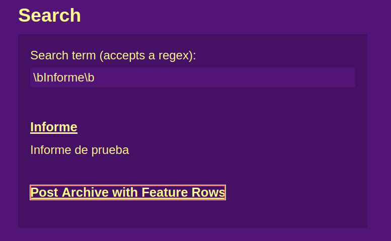

# Práctica: Jekyll search
#### Autor: Edwin Plasencia Hernández

Esta práctica se basa en la anterior de generadores estáticos, por lo que la base del código de la aplicación se puede encontrar en el repositorio de la misma, éste es el mismo que el actual por lo que puede accederse a la versión anterior visitando la rama ***intro2sd*** en el selector de la esquina superior izquierda.

## Objetivos y resultados

El objetivo de la práctica fue el desarrollo e integración de una barra de búsqueda, dicha barra de búsqueda debía permitir encontrar información en todos los lugares del sitio web, tanto posts como pages como collections, debía admitir la búsqueda por expresiones regulares y devolver una lista con los ficheros y una pequeña descripción de cada uno.

El fichero ***/pages/search.md*** contiene el código necesario para la implementación de la búsqueda, dicho fichero hace uso de los scripts ***/assets/src/fetch.js*** y ***/assets/src/search.js*** para obtener los resultados, por otro lado, ***/assets/src/search.json*** contiene el código en **Liquid** para representar correctamente los resultados en la página de búsqueda.

Específicamente, el método ***findResults*** de la clase **JekyllSearch** en el fichero ***search.js*** contiene la porción de código relevante que permite buscar por expresiones regulares, dicha porción de código es la siguiente:

```js
async findResults() {
    this.data = await this.fetchedData()
    const regex = new RegExp(this.searchField.value, 'i')
    return this.data.filter(item => {
    return item.title.match(regex) || item.content.match(regex)
    })
}
```



Como puede verse, los resultados para la expresión regular **\bInforme\b** contienen únicamente los posts/páginas/etc que contengan la palabra ***Informe***, en este caso, con el post de Informe y la página con el archivo de todos los posts del sitio web.

Para que el constructor de la clase reciba un objeto con los elementos necesarios para la búsqueda, se estableció su constructor de la siguiente forma:

```js
constructor(info) {
    this.dataSource = info.dataSource
    this.searchField = document.querySelector(info.searchField)
    this.resultsList = document.querySelector(info.resultsList)
    this.siteURL = info.siteURL

    this.data = [];
}
```

La llamada al constructor de la clase se puede apreciar en el fichero ***search.md*** y contiene el siguiente fragmento de código:

```js
const data = {
    dataSource: '{{site.url}}{{site.baseurl}}/assets/src/search.json',
    searchField: '#search',
    resultsList: '#list',
    siteURL: '/intro2sd-edwin-plasencia-hernandez-alu0101329888/'
  };
  const search = new JekyllSearch(data);
  search.init();
```

Por último, se ha hecho un resumen del capítulo 2 de Developing Information Systems, editado by James Cadle, y se ha subido a un post en el sitio, dicho post puede accederse desde la página web o desde [aquí](https://ull-mii-sytws-2425.github.io/intro2sd-edwin-plasencia-hernandez-alu0101329888/resumen2/).