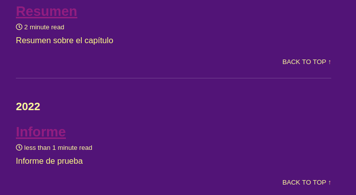

# Práctica: Introduction to Systems Development and Static Generators
#### Autor: Edwin Plasencia Hernández

## Objetivos y resultados

El objetivo de esta práctica es el aprendizaje del uso de Jekyll como generador simple de sitios web estático.

El punto principal es el despliegue de una página haciendo uso de tal software, esta puede accederse a través del enlace en el repositorio en la sección de descripción o si se prefiere, haciendo click [aquí](https://ull-mii-sytws-2425.github.io/intro2sd-edwin-plasencia-hernandez-alu0101329888/)



Dentro de la página podemos observar posts y colecciones principalmente. En los posts, tenemos dos que pueden verse claramente, un informe y un resumen, el post del resumen contiene el resumen al capítulo 1 del libro ***Introduction to Systems Development*** de James Cadle.

En el post del informe podemos ver, por otro lado, el uso de liquid para generar texto haciendo uso de código script.

Para acceder a la página, se ha hecho uso de GitHub Pages, sin embargo, se pedía hacer uso de Netlify o Vercel, con lo que he aprovechado para desarrollar mi página personal y alojar esa en Netlify. Dicha página puede accederse desde mi perfil de GitHub o desde [aquí](https://alu0101329888.netlify.app/)

Para hacer uso de un .json en ***_data***, se creó ***test.json*** con los contenidos siguientes:

```json
{
  "testdata": "works"
}
```

Dicho fichero se accede desde el post del resumen con:
```liquid
Test: Leyendo desde un json.
{{ site.data.test.testdata }}
```

Y devuelve correctamente:

```
Test: Leyendo desde un json. works
```

He reconfigurado los defaults de ***_config.yml*** y he, de entre otras cosas, establecido el skin del site a **plum**.

Por último, he desarrollado una página 404 personalizada haciendo uso del módulo ***async*** y ***web services*** en el que se obtiene la imagen de un gato en tiempo de ejecución y se enseña en la página de manera automática. Dicho código puede verse en el fichero ***404.md*** y el resultado sería algo tal que así:

